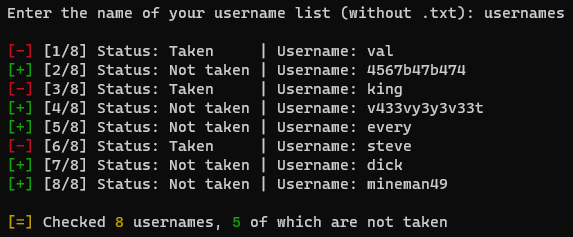

# Minecraft Username Checker

Check availability of minecraft usernames and saves them to a text file. Requires NordVPN to bypass API throttling.

Example usage:



usernames.txt
```
val
4567b47b474
king
v433vy3y3v33t
every
steve
dick
mineman49
```
checked_usernames.txt
```
CHECKED: 25/01/2021 23:03:10 USERNAME: 4567b47b474
CHECKED: 25/01/2021 23:03:10 USERNAME: v433vy3y3v33t
CHECKED: 25/01/2021 23:03:10 USERNAME: every
CHECKED: 25/01/2021 23:03:11 USERNAME: dick
CHECKED: 25/01/2021 23:03:11 USERNAME: mineman49
```
